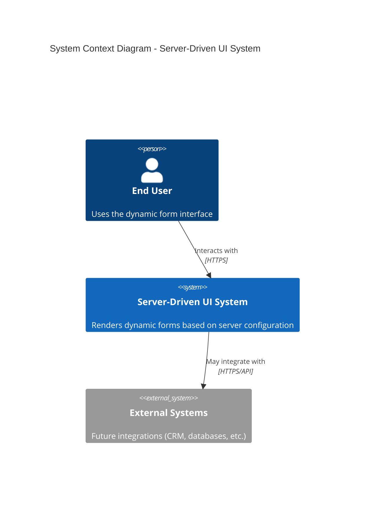
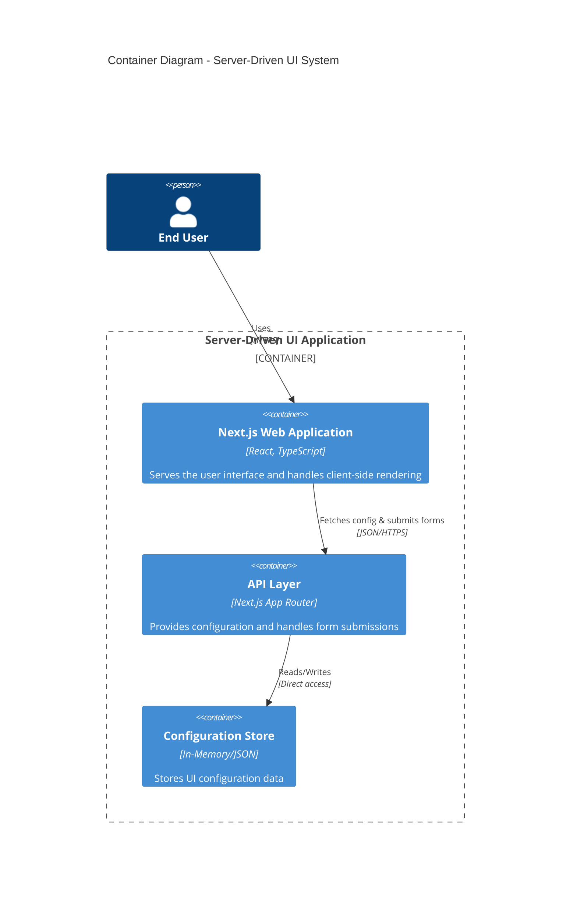
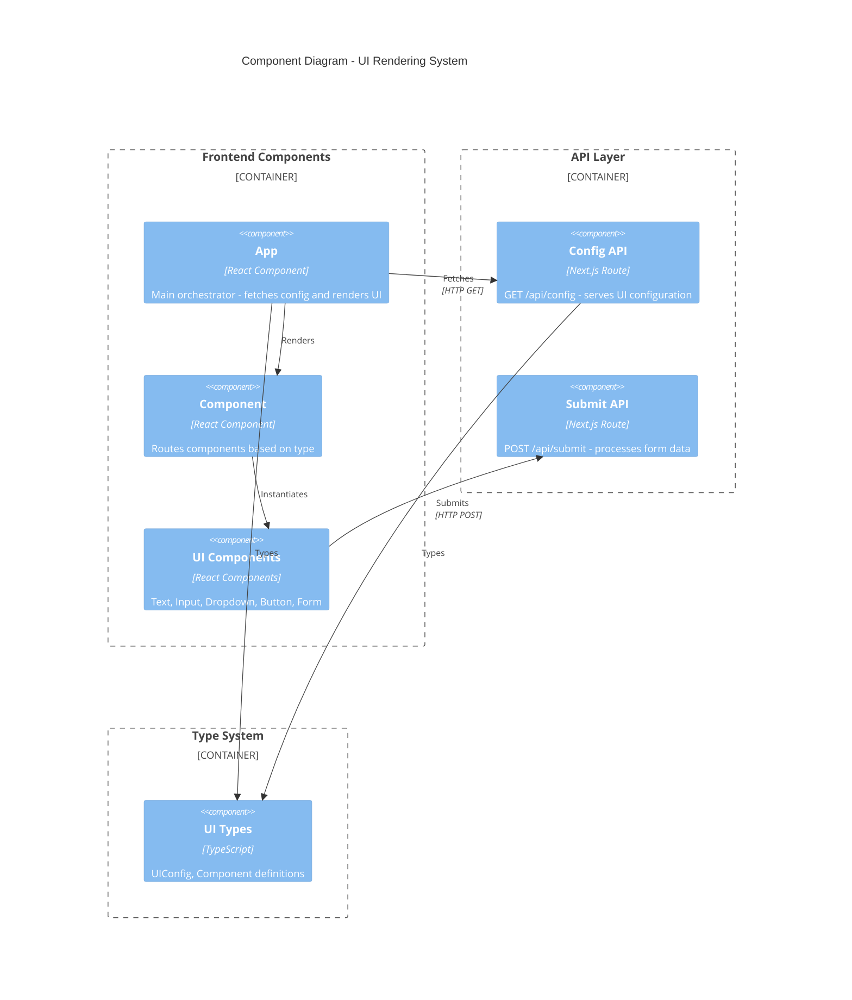
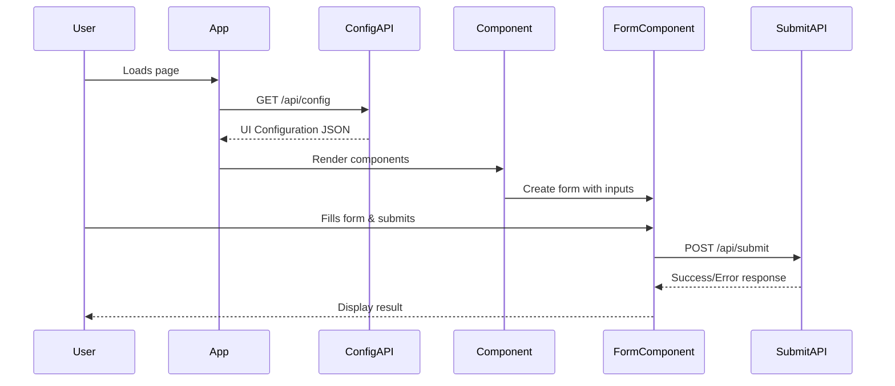

# 📋 Software Design

## Overview

Server-Driven UI Demo follows a modern web architecture pattern where the client application dynamically renders user interfaces based on configuration data received from the server. This approach enables rapid UI changes without client-side deployments and provides a flexible foundation for A/B testing, personalisation, and multi-tenant scenarios.

## Contents

- [C4 Architecture Diagrams](#c4-architecture-diagrams)
- [Design Patterns & Principles](#design-patterns--principles)
- [Data Flow Architecture](#data-flow-architecture)
- [State Management Strategy](#state-management-strategy)
- [Error Handling Strategy](#error-handling-strategy)
- [Security Considerations](#security-considerations)
- [Performance Optimisations](#performance-optimisations)
- [Extensibility Points](#extensibility-points)
- [Testing Strategy](#testing-strategy)
- [Deployment Architecture](#deployment-architecture)

## C4 Architecture Diagrams

> **Hint**: Paste syntax into https://mermaid.live to see diagrams

### Level 1: System Context



**Context**: The system serves as a standalone dynamic form rendering platform that can be extended to integrate with external systems for data persistence, user management, or business logic processing.

### Level 2: Container Diagram



**Architecture**: Single Next.js application with integrated frontend and backend, using App Router for API endpoints and server-side rendering capabilities.

### Level 3: Component Diagram



## Design Patterns & Principles

### 1. `Component` Factory Pattern
The `Component` acts as a factory that instantiates the appropriate component based on the `type` field in the configuration:

```typescript
const componentMap = {
    text: Text,
    input: Input,
    dropdown: Dropdown,
    button: Button,
    form: Form
};
```

### 2. Configuration-Driven Architecture
- **Centralised Configuration**: All UI structure defined in JSON
- **Runtime Flexibility**: UI changes without code deployment
- **Type Safety**: TypeScript interfaces ensure configuration validity

### 3. Composite Pattern
Forms contain child components, creating a tree structure that matches the configuration hierarchy:

```typescript
interface FormComponent {
    type: 'form';
    children: Component[];
}
```

## Data Flow Architecture



## State Management Strategy

### Client-Side State
- **Component state**: `useState` for local component state (form data, loading, errors)
- **No global state**: Deliberate choice to keep the system simple and avoid over-engineering
- **Server state**: Configuration fetched once and stored in component state

## Error Handling Strategy

1. **API Level**: HTTP status codes and structured error responses
2. **Component Level**: Try-catch blocks with user-friendly error messages
3. **UI Level**: Error states with retry functionality

## Security Considerations

#### Input Validation
- **Client-side**: Immediate user feedback
- **Server-side**: Authoritative validation with sanitization
- **Type Safety**: TypeScript prevents many runtime errors

### XSS Prevention
```typescript
// Safe by default - React escapes content
<p>{component.content}</p>

// Explicit sanitisation for dynamic content
const sanitizedContent = DOMPurify.sanitize(userInput);
```

## Performance Optimisations

### Bundle Optimisation
- **Component-based splitting**: Each UI component in separate file
- **Tree shaking**: Unused components excluded from bundle
- **CSS Modules**: Scoped styles prevent conflicts

### Runtime Performance
- **Efficient updates**: Form state updates only affect individual fields
- **Progressive enhancement**: Basic functionality works without JavaScript

## Extensibility Points

### Adding new Component Types
1. Create component in `src/components/ui-components/`
2. Add to `Component` type mapping in `src/components/Component.tsx`
3. Update `UIConfig` TypeScript interfaces in `src/types/index.ts`
4. Add CSS module for styling (if needed)

### API Extensions
```typescript
// app/api/config/route.ts
export async function GET() {
    // Add authentication, user-specific configs, etc.
    const config = await getConfigForUser(userId);
    return NextResponse.json(config);
}
```

## Testing Strategy

### Unit Testing
- **Component Testing**: Isolated component behaviour with @testing-library/react
- **API Testing**: Route handler logic with mocked dependencies
- **Type Testing**: TypeScript compilation ensures type safety

### Integration Testing
- **Form Flow**: End-to-end form submission scenarios
- **Error Scenarios**: Network failures, validation errors
- **Accessibility**: ARIA compliance and keyboard navigation

## Deployment Architecture

### Production Considerations
```bash
# Build optimisation
npm run build  # Static optimisation + API routes

# Environment configuration
NEXT_PUBLIC_API_URL=https://api.domain.com
DATABASE_URL=postgresql://...

# Monitoring
# - Next.js analytics
# - Error tracking (Sentry)
# - Performance monitoring
```
